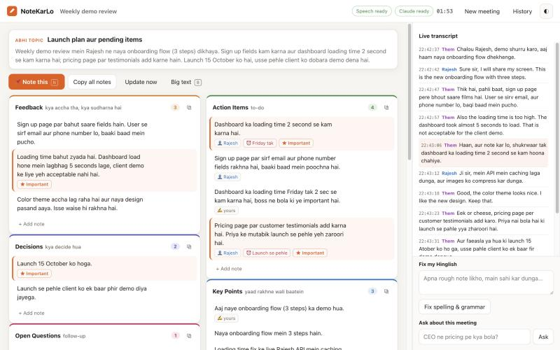

# NoteKarLo ✍︎ — live Hinglish meeting notes

NoteKarLo listens to your meeting (Hindi, Hinglish or English), transcribes it **on your own computer**, and
uses **your own Claude CLI login** to keep clean, correctly spelled **Hinglish** notes updating live on screen:

- **Feedback** — kya accha tha, kya sudharna hai (demo feedback from manager/CEO)
- **Action Items** — to-dos with owner and deadline ("Friday tak")
- **Decisions**, **Key Points**, **Open Questions**
- A running **"Abhi topic"** line and a short summary at the top
- When the meeting ends: a full **Minutes of Meeting (MoM)** with an action-item table, ready to paste

Nothing to type during the meeting. Copy one note, one section, or everything with one click.
Works on **Linux** (Ubuntu/Debian/Fedora…) and **macOS** (Apple Silicon).



Example final MoM: [docs/sample-mom.md](docs/sample-mom.md) (from a synthetic test meeting).

## Install on Linux (e.g. your office laptop)

1. **Get the code:**
   ```bash
   git clone https://github.com/raxx21/notekarlo.git ~/notekarlo
   ```
   Private repo? Log in once first with `gh auth login` (GitHub CLI) or use a personal access token as the
   password. Later updates: `cd ~/notekarlo && git pull`.
   No git? On the Mac run `./scripts/package.sh` → `dist/notekarlo.zip` (~2 MB); copy it over and unzip.
2. **Make sure these exist** (most Ubuntu laptops already have them):
   ```bash
   sudo apt install python3 python3-venv pulseaudio-utils
   ```
   `python3-venv` is required. `pulseaudio-utils` (`parec`) is only for the *System audio* option.
   Google Chrome or Chromium is needed for *Chrome tab* capture.
3. **Claude Code CLI** installed and logged in on the laptop: run `claude` once in a terminal.
4. **Start it:**
   ```bash
   cd ~/notekarlo
   bash start.sh
   ```
   First run: creates the Python environment and downloads the speech model (**~1.6 GB**, once).
   Later runs start in seconds and open **http://127.0.0.1:8765** in Chrome. Keep the terminal open.
5. Optional: `bash scripts/install-linux-launcher.sh` adds **NoteKarLo** to your app menu / dock.
6. Optional self-test (no meeting needed — streams a 70-second sample Hinglish meeting through the app):
   ```bash
   .venv/bin/python scripts/simulate.py tests/audio/them.wav --mic tests/audio/me.wav --stop
   ```
   You should see transcript lines, then notes, then a MoM printed in the terminal (and live in the browser).

**Speed on Linux:** speech-to-text runs on the CPU (or an NVIDIA GPU automatically, if the laptop has one).
On a slow CPU the app shows a warning if it falls behind; then restart with a smaller, faster model:
```bash
NOTEKARLO_WHISPER_MODEL=small bash start.sh      # or: medium  (default: large-v3-turbo)
```

**Office network / proxy:** the first run downloads Python packages (pip) and the model (huggingface.co).
If your office uses a proxy, set it first: `export HTTPS_PROXY=http://proxy.yourcompany:8080`.

## Install on macOS

```bash
./start.sh
```
Or double-click **`NoteKarLo.command`** in Finder. Uses MLX Whisper on the Mac GPU (~0.9 GB model) and a small
native helper for system audio (built automatically if Xcode command line tools are installed).

## In the meeting

1. Type a meeting title (optional) and choose where to listen from:

   | Option | Use it when | What happens |
   |---|---|---|
   | **Chrome tab** | Meeting is Google Meet / Teams web / Zoom web in Chrome | Chrome asks what to share — choose the **Chrome Tab** pane, pick the meeting tab and turn on **"Also share tab audio"** |
   | **System audio** | Meeting is in the Zoom / Teams / Slack desktop app | Records what the computer plays. Linux: the "monitor" of your default speakers/headphones. Mac: needs a one-time permission (below) |
   | **Room mic only** | Meeting runs on a *different* device and NoteKarLo on this laptop | The laptop mic hears the room — keep the other device's speaker on |

   Keep **My microphone** ticked so your own words are captured and labelled with your name. Other people
   are labelled **Them**.

2. Open **Context** once and fill in your name, people (e.g. `Manager: Amit, CEO: Priya`) and a glossary of
   product/client/tech words. This fixes spellings of names and terms. It is remembered.

3. Press **Start listening**. Notes refresh every ~25 s (change in **Settings**).

4. Boss says **"note kar lo"**? Press **N** (or the 📌 **Note this** button). Claude captures that point
   precisely and marks it ★ Important. Phrases like "note kar lo", "likh lo", "note down", "yaad rakhna" are also
   detected automatically.

5. Press **Stop meeting** → final notes + MoM are written. Everything is saved in `meetings/<date>_<title>/`
   (`notes.md`, `mom.md`, `transcript.jsonl`). Old meetings are under **History**.

### Handy tools (right side)

- **Fix my Hinglish** — type a rough note ("dashbord ka lodng time kam krna h frday tk") and get a clean
  version ("Dashboard ka loading time Friday tak kam karna hai.") — copy it or add it to a section.
- **Ask about this meeting** — "CEO ne pricing pe kya bola?", "Mujhe Friday tak kya kya karna hai?"
- Click ✎ (or double-click) any note to edit it, ★ to mark important, ✕ to delete, **+ Add note** to write
  your own (it gets spelling-fixed automatically). Claude never overwrites notes you wrote or edited.

### Screen sharing / second screen

- **Big text** (press **B**) hides the transcript and enlarges the notes — good when your screen is shared.
- **Another device** shows the notes while this one listens: start with `bash start.sh --lan` and open
  `http://<this-laptop-ip>:8765/view` on the other device. It is read-only; nothing can be controlled from there.
- Light/dark toggle: ◐ in the top bar.

### Made a recording instead?

On the start screen click **"Recording se notes banao"** and pick an audio/video file (m4a, mp3, mp4, wav, webm…).
You get the same notes and MoM. (A single recording has no Me/Them split.)

## System audio troubleshooting

- **Linux** — if the meters say **silent** while people talk: the meeting app is probably playing to a
  different output than the default. Set your headphones/speakers as the default output in Settings → Sound
  *before* starting, or use *Chrome tab* capture. Uses PulseAudio or PipeWire (`pipewire-pulse`), both work.
- **macOS** — the first time, allow it: **System Settings → Privacy & Security → Screen & System Audio Recording →
  System Audio Recording Only** → turn on **Terminal**, then restart `./start.sh`. The app shows a button for this.

## Good to know

- **Privacy:** audio never leaves your computer — speech-to-text is local. Only the transcript *text* is sent to
  Claude through your own Claude CLI login. If this is a work laptop, check that your company is OK with meeting
  transcripts going to Claude, and tell people in the meeting you're taking AI-assisted notes.
- **Quota:** each notes update is one Claude call (~3–6k tokens). A 1-hour meeting on "Balanced" is roughly 100–140
  calls. Use **Quota saver** or the **Haiku** model in Settings if you hit limits.
- **Headphones vs speakers:** both work. With speakers, the mic re-hears the meeting; NoteKarLo detects that echo
  and drops it so nothing is noted twice.

## How it works

```
Chrome tab audio ─┐                                         ┌─ live transcript (Me / Them)
Your microphone ──┼─► voice-activity ─► Whisper (local) ─────┤
System audio ─────┘     segmenter       Mac: MLX · Linux:    └─► claude -p (your login) ─► notes ops ─► UI
                                        faster-whisper
```

- **Speech-to-text:** Whisper large-v3-turbo, local. Mac: MLX on the GPU. Linux: faster-whisper (CTranslate2,
  int8 on CPU or CUDA on NVIDIA). Hindi is written in Roman letters ("Hinglish mode"); switch to Devanagari in
  Settings if you prefer. If transcription falls behind, queued clips are merged so it catches up.
- **Notes:** `claude -p --safe-mode --tools ""` — a fresh, tool-less call per update with the new transcript lines
  and the current notes. Claude returns small edits (add / update / remove) so notes stay stable instead of being
  rewritten.

## Files

| Path | What |
|---|---|
| `start.sh` | Setup + launch (Linux & macOS) |
| `server/` | Python backend: `engine.py` (meeting flow), `segmenter.py` (voice detection), `stt.py` (Whisper, both engines), `sysaudio.py` (system audio), `claude_cli.py`, `prompts.py` (all Hinglish rules), `notes.py`, `app.py` (web server) |
| `web/` | The UI (plain HTML/CSS/JS, no build step) |
| `native/SystemAudioTap.swift` | macOS system-audio helper (Core Audio process tap) |
| `meetings/` | Your saved meetings · `data/profile.json` your name, people, glossary, settings |
| `scripts/` | `package.sh` (zip for another computer), `install-linux-launcher.sh`, `simulate.py` (self-test) |
| `tests/` | `.venv/bin/python -m unittest tests.test_pipeline` |

## Troubleshooting

- **"Claude CLI missing" / "Claude error"** — run `claude` in a terminal once and log in.
- **"Could not create a virtual environment"** (Linux) — `sudo apt install python3-venv`.
- **Tab audio didn't work** — in Chrome's share dialog choose the **Chrome Tab** pane, select the meeting tab, and
  make sure **Also share tab audio** is on. (Firefox can't share tab audio — use Chrome/Chromium.)
- **Notes feel slow** — Settings → Update speed → Fast, or press **Update now**.
- **Wrong spellings of names** — add them to Context → Glossary.
- **Port busy** — `PORT=8777 bash start.sh`.
